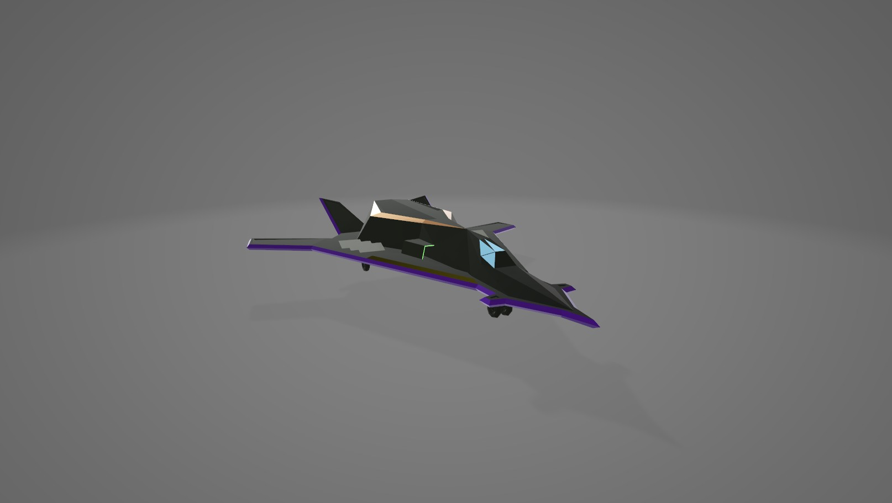

# NAD RACER



A high-speed racing game built for the "Break Monad" event, powered by the Monad blockchain. Race through the cosmic circuits, collect tokens, and compete for the highest score while pushing the boundaries of decentralized gaming.

## 🎮 Game Features

- **Fast-Paced Racing**: Navigate through an endless cosmic track filled with obstacles and challenges
- **Token Collection**: Earn NP (Nad Points) tokens while racing
- **Multiple Ships**: Choose between different ship designs with unique visual styles
- **Global Leaderboard**: Compete with other players for the highest score
- **Blockchain Integration**: Built on Monad Testnet for decentralized gaming experience

## 🕹️ Controls

- **Movement**:
  - Left Arrow / A: Move left
  - Right Arrow / D: Move right
- **Boost**:
  - Space Bar / W: Activate boost
- **Mobile**:
  - Touch controls available for mobile devices

## 🚀 Getting Started

### Prerequisites

- Node.js (v16 or higher)
- npm or yarn
- A web3-enabled browser
- A wallet compatible with Monad Testnet

### Installation

1. Clone the repository:
```bash
git clone [repository-url]
cd NadRacer
```

2. Install dependencies:
```bash
npm install
# or
yarn install
```

3. Start the development server:
```bash
npm run dev
# or
yarn dev
```

4. Open your browser and navigate to `http://localhost:3000`

## 🎯 Gameplay

1. **Connect Wallet**: Use your web3 wallet to connect to the game
2. **Register**: Create your pilot profile
3. **Select Ship**: Choose your preferred ship design
4. **Race**: Navigate through obstacles, collect tokens, and aim for high scores
5. **Compete**: Your highest scores are recorded on the global leaderboard

## 🏆 Scoring System

- Survive longer to increase your score
- Collect NP tokens during the race
- Avoid obstacles to maintain your health
- Use boost strategically to achieve higher scores

## 🔧 Technical Stack

- React.js
- Three.js / React Three Fiber
- TailwindCSS
- Web3 Integration
- Monad Blockchain

## 🎵 Credits

- Ship Models: "space ship" by [yanix](https://skfb.ly/LzKz) (CC BY 4.0)
- Music: [TurtleBeats](https://pixabay.com/users/turtlebeats-46526702/) from Pixabay
- Development: MEFURY

## 🔗 Links

- Twitter: [@meefury](https://x.com/meefury)
- Monad: [@monad_xyz](https://x.com/monad_xyz)

## 📄 License

This project is licensed under the MIT License - see the LICENSE file for details.

---

Built with ❤️ for the Monad community
